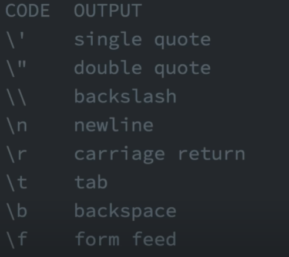
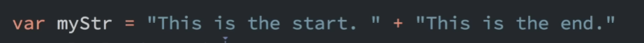

# Learning-JS
**This is the start for me to learn JS for my own skills**
# General Note
 - After any code line in JS the end of the code must write this symbol inside the parentheses **( ; )**
## Variable
 - const

    Used in only the scope that I declare in CAN NOT BE CHANGED
 -  var

    Can be used in all the program
 - let
## Incrementing Numbers
 - Means to add 1

   var myVar = 21; / 2 ways to add 1

   1- myVar = myVar + 1;

   =22

   2- myVar++;

   =22
## Decrementing Numbers
 - Means to cut 1

   var myVar = 22; /  2 ways to cut 1

   1- myVar = myVar - 1;

   =21

   2- myVar--;

   =21
## Escape Sequences in Strings
   

## Concatenating Strings with Plus Operator
   

# JavaScript Learning Roadmap (12 Steps)

A complete step-by-step guide to learning JavaScript, from setup to testing.
Follow each step in order and complete the **Try it** task before moving on.

---

## Step 0 — Setup

1. Install [Node.js](https://nodejs.org/) for running JS outside the browser.
2. Create a folder and add:

   ```
   index.html
   script.js
   ```
3. Sample `index.html`:

   ```html
   <!doctype html>
   <html>
     <head><meta charset="utf-8"><title>JS Playground</title></head>
     <body>
       <h1>Hello JS</h1>
       <script src="script.js" defer></script>
     </body>
   </html>
   ```
4. Open in your browser or use Live Server.
5. Run in terminal:

   ```bash
   node script.js
   ```

**Try it:** Log `"It works!"` to both browser console and terminal.

---

## Step 1 — Values, Types, Variables

* Use `let` (reassignable) and `const` (non-reassignable).
* Template literals: `` `${varName}` ``

Example:

```js
const name = "Abdo";
let score = 10;
console.log(`${name}'s score is ${score}`);
```

**Try it:** Create a number, string, and boolean; log `typeof` each.

---

## Step 2 — Control Flow

```js
const x = 7;
if (x % 2 === 0) console.log("even"); else console.log("odd");

for (let i = 0; i < 3; i++) console.log(i);

const day = "Mon";
switch (day) {
  case "Mon": console.log("Start"); break;
  default: console.log("Other");
}
```

**Try it:** Loop 1→100, sum numbers, log total.

---

## Step 3 — Functions & Scope

```js
function add(a, b = 0) { return a + b; }
const mul = (a, b) => a * b;

function makeCounter() {
  let c = 0; 
  return () => ++c; // closure
}
```

**Try it:** Make `greet(name)` that returns `"Hello, <name>!"`.

---

## Step 4 — Arrays & Objects

```js
const nums = [2, 5, 8];
const doubled = nums.map(n => n * 2);
const evens = nums.filter(n => n % 2 === 0);
const sum = nums.reduce((a, n) => a + n, 0);

const user = { id: 1, name: "Abdo", role: "dev" };
const { name, role } = user;
const user2 = { ...user, role: "senior dev" };
```

**Try it:** From `[1,2,3,4,5]` get only odd numbers and square them.

---

## Step 5 — DOM Basics

HTML:

```html
<button id="btn">Click</button>
<p id="out"></p>
```

JS:

```js
const btn = document.querySelector("#btn");
const out = document.querySelector("#out");
btn.addEventListener("click", () => {
  out.textContent = "Button clicked!";
});
```

**Try it:** Toggle a CSS class on `<p>` when clicked.

---

## Step 6 — Forms & Events

HTML:

```html
<input id="age" placeholder="Age">
<button id="check">Can enter?</button>
<p id="msg"></p>
```

JS:

```js
document.querySelector("#check").addEventListener("click", () => {
  const age = Number(document.querySelector("#age").value);
  document.querySelector("#msg").textContent = age >= 18 ? "Welcome" : "Too young";
});
```

**Try it:** Prevent empty input and show error message.

---

## Step 7 — Fetch & Async/Await

```js
async function getTodo(id) {
  try {
    const res = await fetch(`https://jsonplaceholder.typicode.com/todos/${id}`);
    if (!res.ok) throw new Error(res.status);
    const data = await res.json();
    console.log(data);
  } catch (err) {
    console.error("Fetch failed:", err.message);
  }
}
getTodo(1);
```

**Try it:** Fetch 5 todos, render titles in the DOM.

---

## Step 8 — Modules

`math.js`:

```js
export const add = (a, b) => a + b;
```

In HTML:

```html
<script type="module">
  import { add } from "./math.js";
  console.log(add(2,3));
</script>
```

**Try it:** Create `utils.js` with helpers and import them.

---

## Step 9 — Storage & JSON

```js
const settings = { theme: "dark", lang: "ar" };
localStorage.setItem("settings", JSON.stringify(settings));
const s = JSON.parse(localStorage.getItem("settings") || "{}");
console.log(s.theme);
```

**Try it:** Save form inputs to `localStorage` and restore on reload.

---

## Step 10 — Classes & `this`

```js
class Counter {
  #value = 0; // private
  inc() { this.#value++; }
  get value() { return this.#value; }
}
const c = new Counter();
c.inc(); console.log(c.value);
```

**Try it:** Create `Timer` class with `start()`/`stop()` logging seconds.

---

## Step 11 — Tooling & Debugging

```bash
npm init -y
npm i -D eslint prettier
npx eslint --init
```

* Use VS Code breakpoints & Chrome DevTools.

**Try it:** Add `"dev": "node script.js"` to `package.json` scripts and run `npm run dev`.

---

## Step 12 — Testing with Jest

```bash
npm i -D jest
```

`sum.js`:

```js
export const sum = (a,b)=>a+b;
```

`sum.test.js`:

```js
import { sum } from "./sum.js";
test("adds numbers", ()=>{ expect(sum(2,3)).toBe(5); });
```

Run:

```bash
npm test
```

**Try it:** Test an async function with `async/await`.
